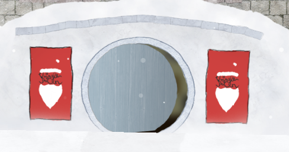
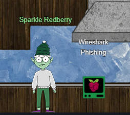
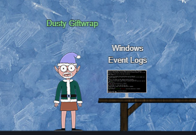
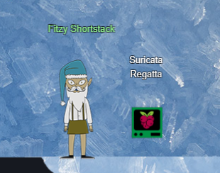

# 2) Recover the Tolkien Ring

> ## Wireshark Practice
> Difficulty: 1/5
>
> Use the Wireshark Phishing terminal in the Tolkien Ring to solve the mysteries around the [suspicious PCAP][1]. Get `hints` for this challenge by typing hint in the upper panel of the terminal.

> ## Find the Next Objective
>
> Talk to Dusty Giftwrap for the next objective.

> ## Windows Event Logs
> Difficulty: 2/5
>
> Investigate the Windows [event log][5] mystery in the terminal or offline. Get hints for this challenge by typing `hint` in the upper panel of the Windows Event Logs terminal.

> ## Find the Next Objective
>
> Talk to Fitzy Shortstack for the next objective.

> ## Suricata Regatta
> Difficulty: 3/5
>
> Help detect this kind of malicious activity in the future by writing some Suricata rules. Work with Dusty Giftwrap in the Tolkien Ring to get some hints.

---
## Walkthrough

To get to the *Tolkien Ring*, Go North-East of Santa (right and up) and you will see a round entrance between two banners:  

Step inside the entrance. Proceed down the ladder, go right, then go down the ladder again, and you will see the *Tolkien Ring* Entrance on the right:

Enter the *Tolkien Ring*, and talk to **Sparkle Redberry**:  

**Sparkle Redberry** will give you [a PCAP file][1] that requires assistance to review, and then answer the questions in the *Wireshark Phishing* termminal beside him.

At the browser bottom panel, you can find the following hints and tips:
1. Each question may have hints. If you want another hint from the elf, just type hint in the upper pane.
2. If you need help with Wireshark filters you can go here: [https://wiki.wireshark.org/DisplayFilters][2]
3. If you need help with tshark filters, try this cheat sheet: [https://cheatography.com/mbwalker/cheat-sheets/tshark-wireshark-command-line/][3]
4. Of course, SANS has lots of cheat sheets that can help: [https://www.sans.org/blog/the-ultimate-list-of-sans-cheat-sheets/][4]

After completing the *Wireshark Phishing* termminal, exit from the terminal and talk to **Sparkle Redberry** to get the next objective and additional hints.

Go right of the room to find **Dusty Giftwrap** and *Windows Event Logs* terminal for the next objective:

**Dusty Giftwrap** gives the option either to download the [log file][5] and analyze on your own machine, or use the *Windows Event Logs* to do the analysis.

At the browser bottom panel, you can find the following hints and tips:
1. **grep** is a very useful tool when completing terminal challenges. 
2. Keep this link handy [https://linuxcommand.org/lc3_man_pages/grep1.html][6]
3. Each question may have hints. If you want another hint from the elf, just type hint in the upper pane.

After completing the *Windows Event Logs* termminal, exit from the terminal and talk to **Dusty Giftwrap** to get the next objective and additional hints.

Go right of the room to find **Fitzy Shortstack** and *Suricata Regatta* terminal for the next objective:

**Fitzy Shortstack** needs you to access *Suricata Regatta* terminal and generate the correct suricata rule to scare off the Snowrog.

For suricata rules generation syntax and help, do use the [Suricata Documentation][8] for reference.

After completing the *Suricata Regatta* termminal, exit from the terminal and talk to **FItzy Shortstack** to complete this whole objective.

## Hints Available:

1. Built-In Hints
> From: Sparkle Redberry  
> Terminal: Windows Event Logs  
> The hardest steps in this challenge have hints. Just type `hint` in the top panel!

2. Event Logs Exposé
> From: Sparkle Redberry  
> Terminal: Windows Event Logs  
> New to Windows event logs? Get a jump start with [Eric's talk][7]!

3. The Tome of Suricata Rules
> From: Dusty Giftwrap  
> Terminal: Suricata Regatta  
> [This][8] is the official source for Suricata rule creation!!

[1]:https://storage.googleapis.com/hhc22_player_assets/suspicious.pcap
[2]:https://wiki.wireshark.org/DisplayFilters
[3]:https://cheatography.com/mbwalker/cheat-sheets/tshark-wireshark-command-line/
[4]:https://www.sans.org/blog/the-ultimate-list-of-sans-cheat-sheets/
[5]:https://storage.googleapis.com/hhc22_player_assets/powershell.evtx
[6]:https://linuxcommand.org/lc3_man_pages/grep1.html
[7]:https://youtu.be/5NZeHYPMXAE
[8]:https://suricata.readthedocs.io/en/suricata-6.0.0/rules/intro.html

---
## Solution (Wireshark Practice)

[Refer to this](./Wireshark_Practice.md) for the solution.

---
## Solution (Windows Event Logs)

[Refer to this](./Windows_Event_Logs.md) for the solution.

---
## Solution (Suricata Regatta)

[Refer to this](./Suricata_Regatta.md) for the solution.