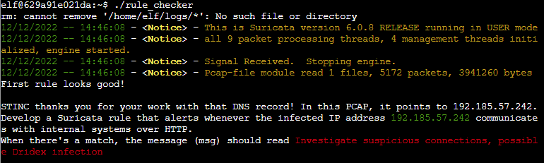
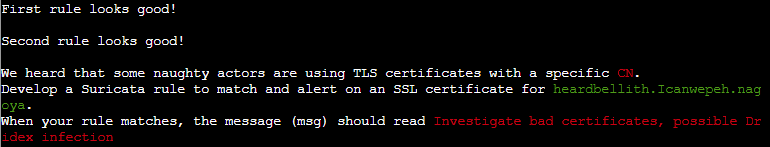
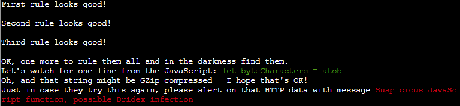

# Solution (Windows Event Logs)

The following is to be done on the *Suricata Regatta* terminal beside **Fitzy Shortstack**.  
Use this [Suricata Documentation][1] to learn how to craft Suricata rules.

[1]:https://suricata.readthedocs.io/en/suricata-6.0.0/rules/intro.html

> First, please create a Suricata rule to catch DNS lookups for adv.epostoday.uk.  
> Whenever there's a match, the alert message (msg) should read ***Known bad DNS lookup, possible Dridex infection***.  
> Add your rule to suricata.rules.  
> Once you think you have it right, run ./rule_checker to see how you've done!

    Answer: alert dns any any -> any any (msg:"Known bad DNS lookup, possible Dridex infection";dns.query;content:"adv.epostoday.uk";sid:3000001;)

> In this PCAP, it points to 192.185.57.242.  
> Develop a Suricata rule that alerts whenever the infected IP address 192.185.57.242 communicates with internal systems over HTTP.  
> When there's a match, the message (msg) should read ***Investigate suspicious connections, possible Dridex infection***.

    Answer: alert http 192.185.57.242 any <> $HOME_NET any (msg:"Investigate suspicious connections, possible Dridex infection";sid:3000002;)

> We heard that some naughty actors are using TLS certificates with a specific CN.  
> Develop a Suricata rule to match and alert on an SSL certificate for heardbellith.Icanwepeh.nagoya.  
> When your rule matches, the message (msg) should read ***Investigate bad certificates, possible Dridex infection***.

    Answer: alert tls any any -> any any (msg:"Investigate bad certificates, possible Dridex infection";tls.cert_subject;content:"CN=heardbellith.Icanwepeh.nagoya";sid:3000003;)

> Let's watch for one line from the JavaScript: let byteCharacters = atob  
> Oh, and that string might be GZip compressed - I hope that's OK!  
> Just in case they try this again, please alert on that HTTP data with message ***Suspicious JavaScript function, possible Dridex infection***.

    Answer: alert http any any -> any any (msg:"Suspicious JavaScript function, possible Dridex infection";file_data;content:"let byteCharacters = atob";sid:3000004;)

Answering all these questions on the terminal will yield an achievement.

Once done, exit the terminal and talk to **Fitzy Shortstack** to complete this main objective.