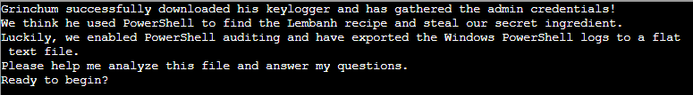
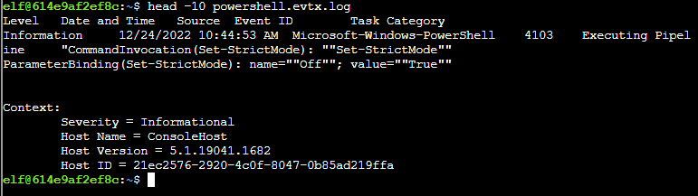
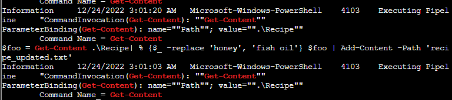
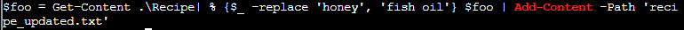
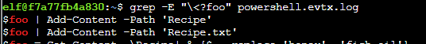
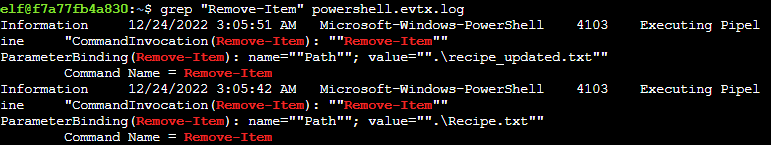
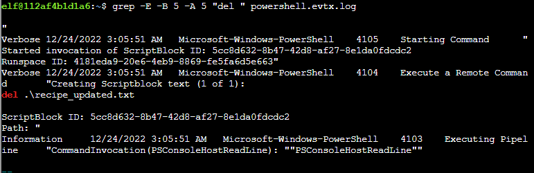
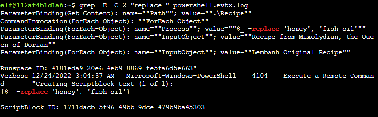

# Solution (Windows Event Logs)

The following is performed on the terminal, but you may download the [log file][5] and analyze on your own machine.

On browser, click on the *Wireshark Phishing* terminal:

Click on the upper panel, and enter **Return** key to proceed.

> 1. What month/day/year did the attack take place? For example, 09/05/2021

    Answer: 12/24/2022

run the following command to see the timestamp:  
`head -10 powershell.evtx.log`

> 2. An attacker got a secret from a file. What was the original file's name

    Answer: Recipe

Run the following command to find the filename:  
`grep -i "add-content" powershell.evtx.log`

> 3. The contents of the previous file were retrieved, changed, and stored to a variable by the attacker. This was done multiple times. Submit the last full PowerShell line that performed only these actions.

    Answer: $foo = Get-Content .\Recipe| % {$_ -replace 'honey', 'fish oil'} $foo | Add-Content -Path 'recipe_updated.txt

Using the same **grep** command, we can find the command the attacker did to get content, change it and store in a variable:  

> After storing the altered file contents into the variable, the attacker used the variable to run a separate command that wrote the modified data to a file. This was done multiple times. Submit the last full PowerShell line that performed only this action
    
    Answer: $foo | Add-Content -Path 'Recipe'

Run the folowing command to find all the commands related to `$foo`:  
`grep -E "\<?foo" powershell.evtx.log`, and get the first command in the list, as the windows logs are in reverse chronological order:

> 5. The attacker ran the previous command against a file multiple times. What is the name of this file?

    Answer: Recipe.txt

The filename is also listed in the same output as the previous command.

> 6. Were any files deleted? (Yes/No

    Answer: Yes

Run the following command to check if attacker has removed any file:  
`grep "Remove-Item" powershell.evtx.log`

> 7. Was the original file (from question 2) deleted? (Yes/No)

    Answer: Yes

Compare the answer from Qn 2 against the items deleted in Qn 6 to get the answer for Question 7.

> 8. What is the Event ID of the log that shows the actual command line used to delete the file?

    Answer: 4104

Run the following command to find the Event ID:  
`grep -E -B 5 -A 5 "del " powershell.evtx.log`

> 9. Is the secret ingredient compromised (Yes/No)?

    Answer: Yes

> 10. What is the secret ingredient?

    Answer: Honey

Answer is given using the same previous command.

Answering all these questions on the terminal will yield an achievement.

Once done, exit the terminal and talk to **Fitzy Shortstack** for the next objective.