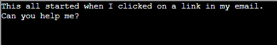
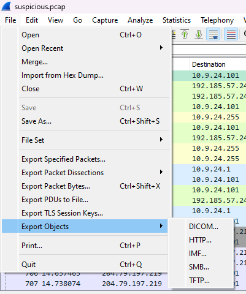
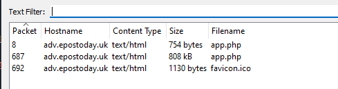
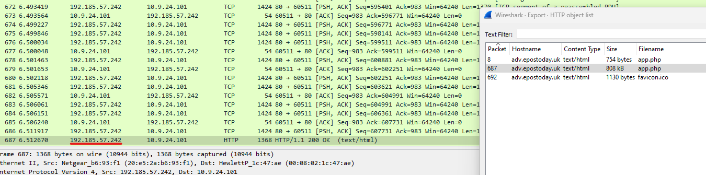
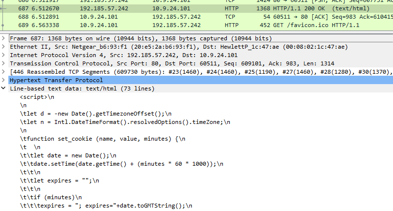
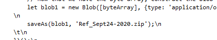
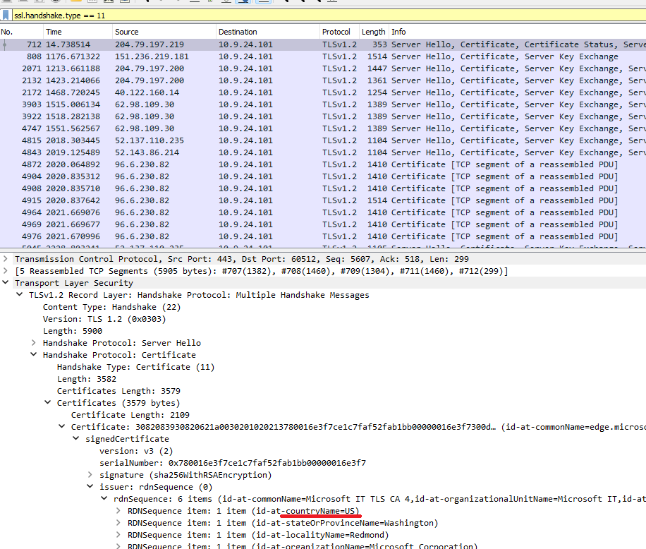

# Solution (Wireshark Practice)

Download the [PCAP file][1], and open it using a Wireshark.

On browser, click on the *Wireshark Phishing* terminal:

Click on the upper panel, and enter **Return** key to proceed.

> 1. There are objects in the PCAP file that can be exported by Wireshark and/or Tshark. What type of objects can be exported from this PCAP?

    Answer: HTTP

We can get this by clicking on `File->Export Objects` then check every single options to reveal only HTTP has objects to export:

> 2. What is the file name of the largest file we can export?

    Answer: app.php

Open `File-> Export Objects->HTTP` and find the filename with the largest file size:

> 3. What packet number starts that app.php file?

    Answer: 687

The packet number is also available on the first column of the export prompt.

> 4. What is the IP of the Apache server?

    Answer: 192.185.57.242

Click on the file and look back on the Wireshark GUI to find the source destination IP:  

> 5. What file is saved to the infected host?

    Answer: 

Look under the packet to see a liner that states *Line-based text data: text/html (73 lines)*.  

Expand it and look through the text to find the file name that is saved to the infected host:  

> 5. Attackers used bad TLS certificates in this traffic. Which countries were they registered to? Submit the names of the countries in alphabetical order separated by a commas (Ex: Norway, South Korea).

    Answer: Israel, South Sudan, USA

Run the following display filter to search for all the TLS certificates:  
`ssl.handshake.type == 11`  
Then expand `Transport Layer Security -> TLSv1.2 Record Layer -> Handshake Protocol: Certificate -> Certificates -> SignedCertificate -> issuer:rdnSequence` to find the country code:

> 5. Is the host infected (Yes/No)?

    Answer: Yes

Answering all these questions on the terminal will yield an achievement.

Once done, exit the terminal and talk to **Dusty Giftwrap** for the next objective.