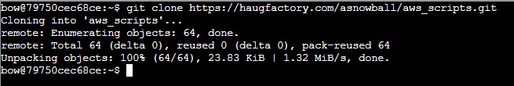
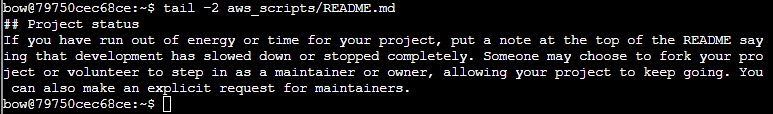
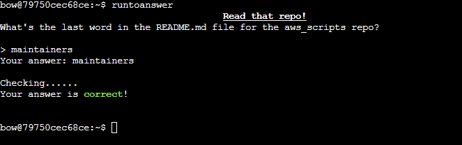

# Solution (Clone With A Difference)

The following is to be done on the *Clone with a Difference* terminal beside **Bow Ninecandle**.  
Use this [Git Guide][1] to learn how to do git cloning.

[1]:https://github.com/git-guides/git-clone

> We just need you to clone one repo: `git clone git@haugfactory.com:asnowball/aws_scripts.git`. This should be easy, right?  
> Thing is: it doesn't seem to be working for me. This is a **public** repository though. I'm so confused!  
> Please clone the repo and `cat` the **README.md** file.  
> Then `runtoanswer` and tell us the last word of the README.md file!

    Answer: maintainers

Use the following git command to clone the repository:  
`git clone https://haugfactory.com/asnowball/aws_scripts.git`

read the last word of the README.md file using the following:  
`tail -2 aws_scripts/README.md`

Then enter `runtoanswer` and enter the answer:

Entering the answer on the terminal will yield an achievement.

Once done, exit the terminal and talk to **Bow Ninecandle** for the next objective.