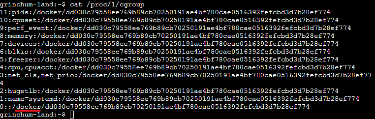
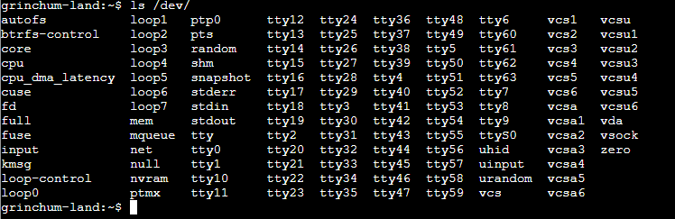
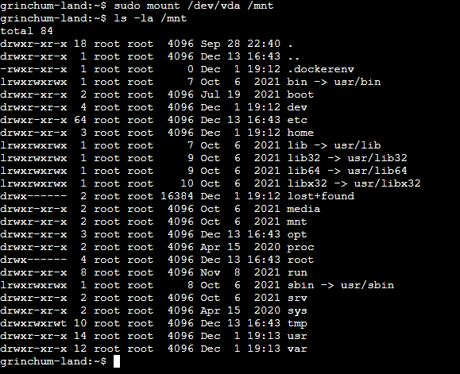
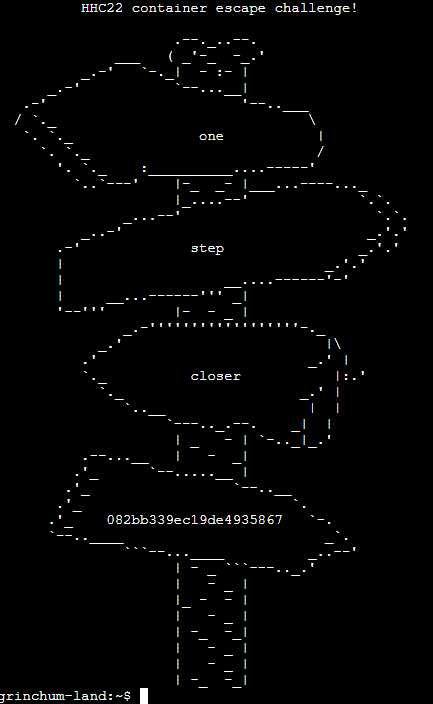
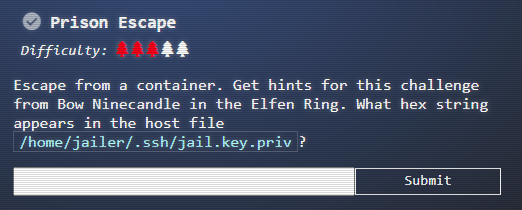

# Solution (Prison Escape)

The following is to be done on the *Prison Escape* terminal beside **Tinsel Upatree**.  
Use this [guide][1] to learn how to navigate a container privileged mode.

[1]:https://learn.snyk.io/lessons/container-runs-in-privileged-mode/kubernetes/

> You find yourself in a jail with a recently captured Dwarven Elf.  
> He desperately asks your help in escaping for he is on a quest to aid a friend in a search for treasure inside a crypto-mine.  
> If you can help him break free of his containment, he claims you would receive "MUCH GLORY!"  
> Please, do your best to un-contain yourself and find the keys to both of your freedom.

    Answer: 082bb339ec19de4935867

Run the following command to double confirm we are in a container:  
`cat /proc/1/cgroup` -- the presence of the "docker" in the output means we are in a container

Run the following command to check if we are in a privileged container:  
`ls /dev/` -- presence of many devices in the output means we are in a privileged container

`sudo fdisk -l` -- presence of a disk block */dev/vda*

We can mount the disk by using the `mount` command:  
`sudo mount /dev/vda /mnt` -- *sudo* is important to perform administrative commands

We know from the objective that the key content is in the host file `/home/jailer/.ssh/jail.key.priv`:  
`cat /mnt/home/jailer/.ssh/jail.key.priv`

Enter the answer (key content) in the Objective page () will yield an achievement.

Once done, exit the terminal and talk to **Tinsel Upatree** for the next objective.