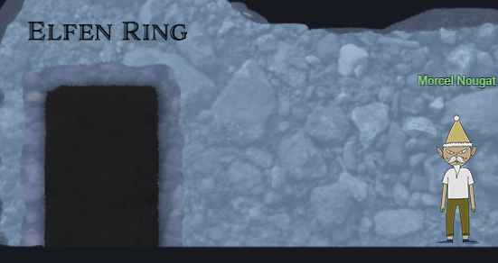
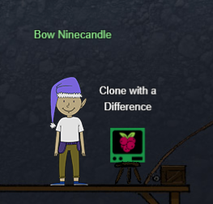
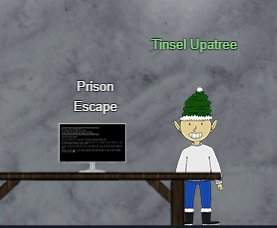
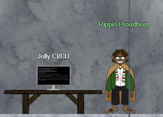

# 2) Recover the Elfen Ring

> ## Clone with a Difference
> Difficulty: 1/5
>
> Clone a code repository. Get hints for this challenge from Bow Ninecandle in the Elfen Ring.

> ## Find the Next Objective
>
> Talk to Bow Ninecandle for the next objective.

> ## Prison Escape
> Difficulty: 3/5
>
> Escape from a container. Get hints for this challenge from Bow Ninecandle in the Elfen Ring. What hex string appears in the host file `/home/jailer/.ssh/jail.key.priv`?

> ## Find the Next Objective
>
> Talk to Tinsel Upatree for the next objective.

> ## Jolly CI/CD
> Difficulty: 5/5
>
> Exploit a CI/CD pipeline. Get hints for this challenge from Tinsel Upatree in the Elfen Ring.

---
## Walkthrough

To get to the *Elfen Ring*, Go North-East of Santa (right and up) and you will see a round entrance between two banners:  

Step inside the entrance. Proceed down the ladder, go right, then go down the ladder again. This level, right side should lead to *Tolkien Ring*. Instead of going right to *Tolkien Ring*, take the left past **Grinchum** and go down the ladder. *Elfen Ring* will be at the bottom of the ladder to the left past **Morcel Nougat**:

Enter the *Elfen Ring*, go down the steps onto the boat, and move right to find **Bow Ninecandle** and *Clone with a Difference* terminal. Talk to **Bow Ninecandle**:  

**Bow Ninecandle** will ask for your assistance to clone a repository using the *Clone with a Difference* terminal.

For help on doing github repository cloning, check out the guide [here][1].

After completing the *Clone with a Difference* terminal, exit from the terminal and talk to **Sparkle Redberry** to get the next objective and additional hints.

Continue right of the river till the end where there are steps up to the next room. Enter the room to find **Tinsel Upatree** and *Prison Escape* terminal for the next objective:

**Tinsel Upatree** requests your assistance to work on getting out of the supposed secure container in the *Prison Escape* terminal.

For help on learning how to manipulate or exploit over-permissioned users in containers, check out the guide [here][2].

After completing the *Prison Escape* terminal, exit from the terminal and talk to **Tinsel Upatree** to get the next objective and additional hints.

Go take the ladder in the same room to find **Rippin Proudboot** and *Jolly CI/CD* terminal for the next objective:

**Rippin Proudboot** needs your assistance to check for any misconfiguration or vulnerabilities in the CI/CD pipeline using the *Jolly CI/CD* terminal, exploit the website and get the *Elfen Ring* back.

After completing the *Jolly CI/CD* termminal, exit from the terminal and talk to **Rippin Proudboot** to complete this whole objective.

## Hints Available:

1. HTTPS Git Cloning
> From: Bow Ninecandle 
> Terminal: Clone with a Difference
> There's a consistent format for Github repositories cloned [via HTTPS][1]. Try converting!

2. Over-Permissioned
> From: Bow Ninecandle
> Terminal: Prison Escape
> When users are over-privileged, they can often act as root. When containers have too many [permissions][2], they can affect the host!

3. Mount Up and Ride
> From: Bow Ninecandle
> Terminal: Prison Escape 
> Were you able to `mount` up? If so, users' `home/` directories can be a great place to look for secrets...

4. Commiting to Mistakes
> From: Tinsel Upatree  
> Terminal: Jolly CI/CD  
> The thing about Git is that every step of development is accessible – even steps you didn't mean to take! `git log` can show code skeletons.

5. Switching Hats
> From: Tinsel Upatree  
> Terminal: Jolly CI/CD  
> If you find a way to impersonate another identity, you might try re-cloning a repo with their credentials.

[1]:https://github.com/git-guides/git-clone
[2]:https://learn.snyk.io/lessons/container-runs-in-privileged-mode/kubernetes/
[3]:

---
## Solution (Clone With A Difference)

[Refer to this](./Clone_With_A_Difference.md) for the solution.

---
## Solution (Prison_Escape)

[Refer to this](./Prison_Escape.md) for the solution.

---
## Solution (Jolly CI/CD)

[Refer to this](./Jolly_CICD.md) for the solution.