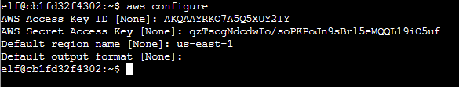
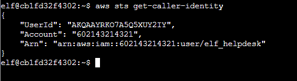

# Solution (AWS CLI Intro)

The following is to be done on the *AWS CLI 101* terminal beside **Jill Underpole**.  
If required, use this [tip][1] on AWS STS service given by **Jill Underpole** to assist with this objective.

[1]:https://awscli.amazonaws.com/v2/documentation/api/latest/reference/sts/get-caller-identity.html

> You may not know this, but AWS CLI help messages are very easy to access. First, try typing:
> $ aws help

Enter `aws help` to proceed:

> Great! When you're done, you can quit with q.
> Next, please configure the default aws cli credentials with the access key AKQAAYRKO7A5Q5XUY2IY, the secret key qzTscgNdcdwIo/soPKPoJn9sBrl5eMQQL19iO5uf and the region us-east-1 .
> https://docs.aws.amazon.com/cli/latest/userguide/cli-configure-quickstart.html#cli-configure-quickstart-config

Configure the aws cli credential using the `aws configure` command:  

> Excellent! To finish, please get your caller identity using the AWS command line. For more details please reference:
> $ aws sts help
> or reference: https://awscli.amazonaws.com/v2/documentation/api/latest/reference/sts/index.html

Get the STS identify info using `aws sts get-caller-identity` command:

Completing this will earn you an achievement.  
Talk to **Jill Underpole** again to lead to the next objective.
