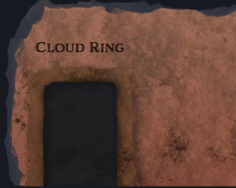
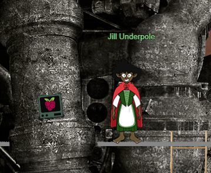
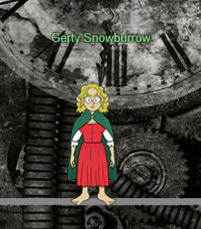
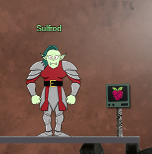

# 2) Recover the Cloud Ring

> ## AWS CLI Intro
> Difficulty: 1/5
>
> Try out some basic AWS command line skills in this terminal. Talk to Jill Underpole in the Cloud Ring for hints.

> ## Find the Next Objective
>
> Talk to Jill Underpole for the next objective.

> ## Trufflehog Search
> Difficulty: 2/5
>
> Use Trufflehog to find secrets in a Git repo. Work with Jill Underpole in the Cloud Ring for hints. What's the name of the file that has AWS credentials?

> ## Find the Next Objective
>
> Talk to Gerty Snowburrow for the next objective.

> ## Exploitation via AWS CLI
> Difficulty: 3/5
>
> Flex some more advanced AWS CLI skills to escalate privileges! Help Gerty Snowburrow in the Cloud Ring to get hints for this challenge.

---
## Walkthrough

To get to the *Cloud Ring*, Go North-East of Santa (right and up) and you will see a round entrance between two banners:  

Step inside the entrance.  
Proceed down the ladder, go right, then go down the ladder again. This level, right side is the *Tolkien Ring*.  
Take the left past **Grinchum** and go down the ladder. *Elfen Ring* will be on the left at the bottom of this ladder.  
Proceed right and down the ladder to find *Web Ring* on the right.  
Go left and go down ladder again to find the *Cloud Ring*.

Enter the *Cloud Ring*, go down the ladder, and take the first short ladder to the left to talk to **Jill Underpole**:  

**Jill Underpole** will ask you to give it a try on the *AWS CLI 101* terminal to her left, and provide a tip on using AWS CLI.

After completing the *AWS CLI 101* terminal, exit from the terminal and talk to **Jill Underpole** to get the next objective and additional hints.

Go left past **Jill Underpole** and go up the ladder to reach **Gerty Snowburrow** for the next objective:

**Gerty Snowburrow** knows that Alabaster Snowball has commited some secrets into [a code repo][2], and wants your help to find those secrets.

After finding the secret, talk to **Gerty Snowburrow** to get the next objective and additional hints.

Go back down the ladders to the bottom level, and proceed left and take the leftmost ladder all the way up to **Sulford** and the *AWS CLI 201* terminal.

**Sulfrod** asks you to look into the terminal, solve it and get the *Elfen Ring* back.

After completing the *AWS CLI 201* terminal, exit from the terminal and talk to **Sulfrod** to complete the object and get the ***Cloud Ring***!

## Hints Available:

1. AWS Whoami?
> From: Jill Underpole 
> Terminal: AWS CLI 101
> In the AWS command line (CLI), the Secure Token Service or [STS][1] has one very useful function.

2. Trufflehog Tool
> From: Jill Underpole
> Terminal: Trufflehog Search
> You can [search for secrets][3] in a Git repo with `trufflehog git https://some.repo/here.git`.

3. Checkout Old Commits
> From: Jill Underpole
> Terminal: Trufflehog Search
> If you want to look at an older code commit with git, you can `git checkout CommitNumberHere`.

4. (Attached) User Policies
> From: Gerty Snowburrow 
> Terminal: AWS CLI 201
> AWS [inline policies][4] pertain to one identity while managed policies can be attached to many identities.

5. IAM Privilege Escalation
> From: Gerty Snowburrow 
> Terminal: AWS CLI 201
> You can try `s3api` or `lambda` service commands, but [Chris Elgee's talk][5] on AWS and IAM might be a good start!

[1]:https://awscli.amazonaws.com/v2/documentation/api/latest/reference/sts/get-caller-identity.html
[2]:https://haugfactory.com/asnowball/aws_scripts.git
[3]:https://github.com/trufflesecurity/trufflehog
[4]:https://docs.aws.amazon.com/IAM/latest/UserGuide/access_policies_managed-vs-inline.html
[5]:https://youtu.be/t-xDvVUialo

---
## Solution (AWS CLI Intro)

[Refer to this](./AWS_CLI_Intro.md) for the solution.

---
## Solution (Trufflehog Search)

[Refer to this](./Trufflehog_Search.md) for the solution.

---
## Solution (Exploitation Via AWS CLI)

[Refer to this](./Exploitation_Via_AWS_CLI.md) for the solution.