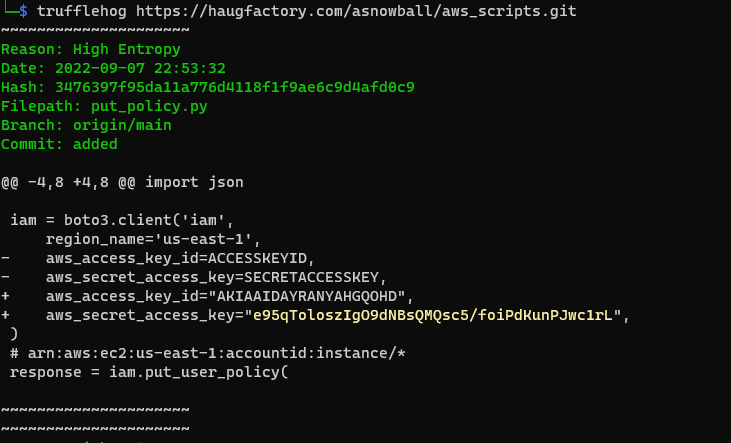

# Solution (Trufflehog Search)

The following is to be done using your own CMD terminal (recommended), or you can use the *AWS CLI INTRO* terminal beside **Jill Underpole**.  
After talking to **Gerty Snowburrow**, she reveals that Alabaster Snowball has mistakenly commited some secrets on [a code repo][1]. So we need to clone this repo and search for the secret within.  
If required, use the following hints to assist with this objective.

- You can [search for secrets][2] in a Git repo with `trufflehog git https://some.repo/here.git`.
- If you want to look at an older code commit with git, you can `git checkout CommitNumberHere`.

 Answer: put_policy.py

[1]:https://haugfactory.com/asnowball/aws_scripts.git
[2]:https://github.com/trufflesecurity/trufflehog

---

## Below solution uses Trufflehog on Kali-Linux machine to search for the secrets.

First open a CMD terminal, and install Trufflehog:
`sudo apt install trufflehog`

Then use the following command to search the git repo:  
`trufflehog https://haugfactory.com/asnowball/aws_scripts.git`

There will be multiple results, but they point to the same filename, which is the answer.

Enter the answer in the input field located at the objectives page to complete this objective and claim an achievement.  
Once done, talk to **Gerty Snowburrow** for the next objective/hints.